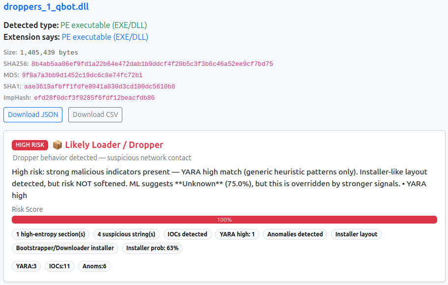
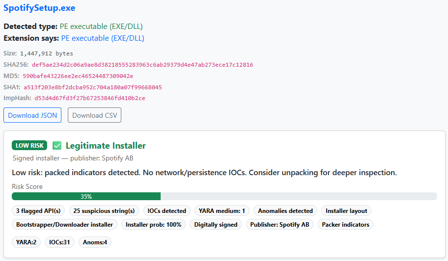

# ObfusGuard

**Static PE malware analysis engine and explainable verdicts without execution.**

ObfusGuard analyzes Windows PE files (EXE, DLL) and returns a structured verdict fusing entropy mapping, ML-based byte distribution classification, packer detection, YARA-based IOC enrichment, and a rule-based scoring engine. No execution. No sandbox. No file leaves your environment.

**97% detection accuracy** across a 1150-file validated corpus spanning ransomware, RATs, stealers, droppers, and packed malware.

→ **Live demo:** [obfusguard.com](https://www.obfusguard.com)  
→ **API access:** Request a key via support@obfusguard.com

---

## The problem ObfusGuard solves

Your EDR flagged a file. Now what?

Before you can escalate, detonate, or dismiss, you need to know what you're looking at. Most static analysis tools return a score or a signature match. ObfusGuard returns a **verdict with reasoning**: what signals fired, why they matter, and what the file structure tells you about its intent.

That's the triage gap ObfusGuard fills. The moment between detection and decision.

---

## Verdict examples

### Malware — QBot Dropper (`droppers_1_qbot.dll`)

**Verdict:** `HIGH RISK — Likely Loader / Dropper`  
**Risk Score:** 100  
**Reason:** Dropper behavior detected — suspicious network contact

```json
{
  "filename": "droppers_1_qbot.dll",
  "verdict": "High risk: strong malicious indicators present — YARA high match. Installer-like layout detected, but risk NOT softened. ML suggests Unknown (75.0%), but this is overridden by stronger signals.",
  "score_result": {
    "level": "HIGH",
    "threat_class": "Likely Loader / Dropper",
    "threat_reason": "Dropper behavior detected — suspicious network contact",
    "top_class": "Unknown",
    "top_percent": 75.0
  },
  "badges": [
    "1 high-entropy section(s)",
    "4 suspicious string(s)",
    "IOCs detected",
    "YARA high: 1",
    "Anomalies detected",
    "Installer layout",
    "Bootstrapper/Downloader installer",
    "Installer prob: 63%"
  ],
  "yara_hits": [
    {
      "rule": "OG_Shellcode_PEB_Walk_x86",
      "severity": "high",
      "meta": {
        "description": "x86 PEB walking to resolve kernel32 base — classic shellcode technique",
        "mitre_technique": "T1106"
      }
    },
    {
      "rule": "OG_Suspicious_Overlay",
      "severity": "medium",
      "meta": {
        "description": "Detects large opaque overlay appended to a PE file",
        "mitre_technique": "T1027"
      }
    }
  ],
  "ioc_count": 11,
  "anomaly_count": 6,
  "duration_ms": 9272
}
```



---

### Benign — SpotifySetup.exe

**Verdict:** `LOW RISK — Legitimate Installer`  
**Risk Score:** 35  
**Reason:** Signed installer — publisher: Spotify AB

```json
{
  "filename": "SpotifySetup.exe",
  "verdict": "Low risk: packed indicators detected. No network/persistence IOCs. Consider unpacking for deeper inspection.",
  "score_result": {
    "level": "LOW",
    "threat_class": "Legitimate Installer",
    "threat_reason": "Signed installer — publisher: Spotify AB",
    "top_class": "Unclassified",
    "top_percent": 75.0
  },
  "badges": [
    "3 flagged API(s)",
    "25 suspicious string(s)",
    "IOCs detected",
    "YARA medium: 1",
    "Anomalies detected",
    "Installer layout",
    "Bootstrapper/Downloader installer",
    "Installer prob: 100%",
    "Digitally signed",
    "Publisher: Spotify AB",
    "Packer indicators"
  ],
  "ioc_count": 31,
  "anomaly_count": 16,
  "duration_ms": 24331
}
```


---

Same surface signals, installer layout, IOCs, anomalies, but ObfusGuard correctly separates them. The QBot dropper hits HIGH on YARA-confirmed shellcode patterns and suspicious overlay. 
The Spotify installer stays LOW on publisher trust, signature verification, and benign ML mass.

---

## How it works

ObfusGuard fuses five independent analysis layers into a single verdict:

**1. Entropy Mapper**  
Per-section and sliding-window entropy analysis. Detects packed regions, high-entropy overlays, and byte distribution anomalies using chi-squared statistics and z-score outlier detection.

**2. ML Byte Distribution Classifier**  
Classifies files into: `Benign / Compressed / Encrypted / Obfuscated / Packed / Unknown`. Trained on a large corpus of known samples. ML output is one signal among many and it can be overridden by stronger structural evidence.

**3. YARA Engine**  
122 rules across 19 rule files covering shellcode patterns, packer signatures, dropper behavior, network IOCs, anti-debug techniques, and MITRE ATT&CK-mapped threat families. All rules include PE/ELF magic guards to prevent false fires on non-PE content.

**4. IOC Extractor**  
Extracts network indicators, suspicious API imports, registry keys, and behavioral strings from the PE without execution.

**5. Rule-Based Verdict Engine**  
A sequential scoring engine that fuses all signals with weighted mutation rules, publisher trust gates, packer evasion paths, and ML mass gates. Returns a final score (0–100), verdict label, threat class, and full reasoning trace.

---

## Key design decisions

**No execution.** ObfusGuard is static-only. Files are never run, detonated, or sent to an external service.

**No cloud dependency.** Deployed as an on-premises Docker image. Files never leave your environment. Suitable for air-gapped deployments, regulated industries, and privacy-sensitive workflows.

**Explainable verdicts.** Every verdict includes the signals that fired, the YARA rules matched, the ML classification, and the scoring trace. Analysts understand not just the conclusion, but the evidence behind it.

**Verdict over score.** ObfusGuard doesn't return a raw number and leave interpretation to the analyst. It returns a verdict label (`HIGH / MEDIUM / LOW`), a threat class (`Likely Loader / Dropper`, `Legitimate Installer`, etc.), and a human-readable reason. The score is supporting evidence.

---

## Deployment

ObfusGuard is delivered as an on-premises Docker image with a Flask web UI and REST API.

```bash
docker pull obfusguard/engine
docker run -p 8080:8080 obfusguard/engine
```

---

## API

```bash
curl -X POST "https://www.obfusguard.com/api/analyze" \
  -H "X-API-Key: YOUR_API_KEY" \
  -F "file=@/path/to/sample.exe"
```

**Response fields:**

| Field | Description |
|---|---|
| `verdict` | Human-readable verdict string |
| `score_result.level` | `HIGH` / `MEDIUM` / `LOW` |
| `score_result.threat_class` | Threat classification label |
| `score_result.threat_reason` | Primary reason for verdict |
| `yara_hits` | Matched YARA rules with MITRE mapping |
| `ioc_indicators` | Extracted network and behavioral IOCs |
| `badges` | Summary signal tags |
| `anomaly_breakdown` | Entropy and chi-squared anomaly detail |
| `ml_scores` | Per-class ML probability breakdown |
| `duration_ms` | Analysis time in milliseconds |

Request a trial API key at support@obfusguard.com

---

## Benchmark

| Category | Accuracy |
|---|---|
| Ransomware | High |
| RATs | High |
| Stealers | High |
| Droppers | High |
| Packed malware | High |
| Benign installers | High |
| **Overall** | **96% across 1150 files** |

Benchmark methodology: single-pass analysis on a curated corpus of known-label samples. No sample was used in training. Results reflect production engine performance as of May 2026.

---

## Known limitations

ObfusGuard is optimized for Windows PE files (EXE, DLL). It does not analyze scripts, documents, or non-PE formats. It does not perform dynamic analysis or behavioral detection. Zero-signal samples, files with no structural indicators, present a natural ceiling for any static-only engine. Files requiring unpacking for meaningful signal extraction may produce lower-confidence verdicts without the unpacking step.

These are not bugs. They are honest constraints of static-only analysis, and knowing them helps analysts use ObfusGuard appropriately.

---

## Use cases

- **DFIR triage:** Analyze suspicious PE files recovered during incident response before escalating or detonating.
- **SOC automation:** Integrate the API into alert enrichment pipelines to add static verdict context to EDR alerts.
- **Forensic investigation:** Add static PE analysis to device extraction workflows without sending evidence to the cloud.
- **Detection engineering:** Use verdict traces and YARA hits to understand signal coverage and tune detection logic.
- **Security platform integration:** Embed ObfusGuard as a static analysis layer in XDR, SIEM, or SOAR pipelines via REST API.

---

## About

ObfusGuard is an independent project.
For API access, integration inquiries, or licensing contact support@obfusguard.com

---

*ObfusGuard is proprietary software. This repository contains public documentation only. All rights reserved.*
